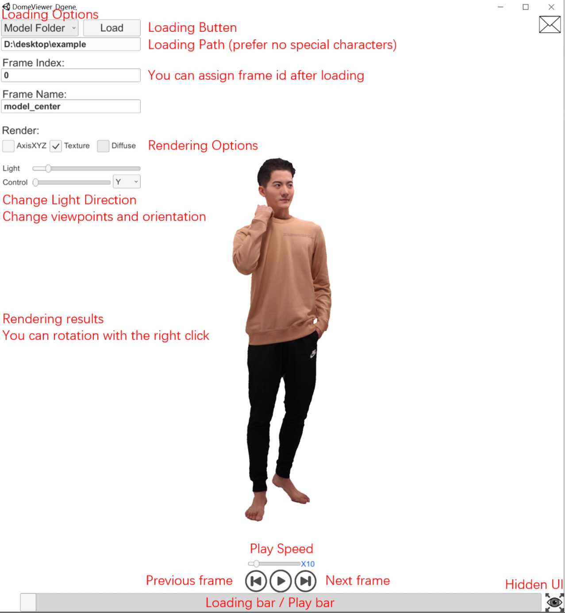
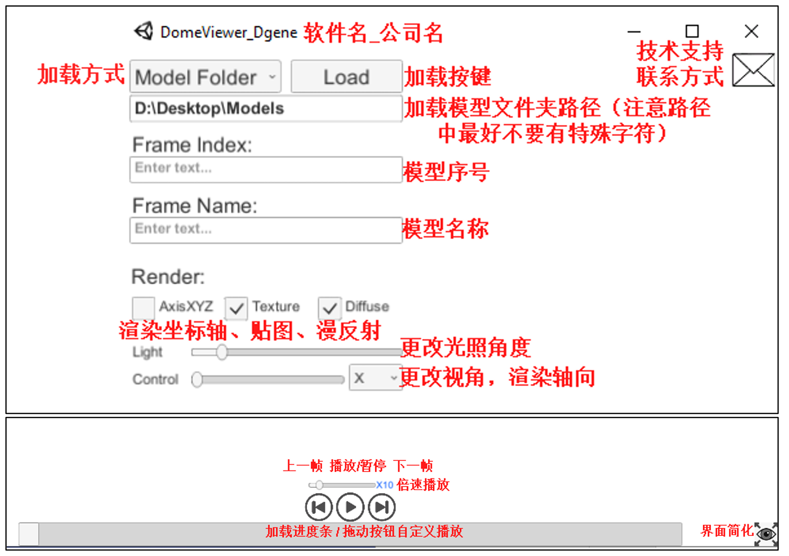

# DomeViewer

## Intro
Domeviewer is used to play 4D dynamic mesh sequences, which can freely pause, play and fast forward the model after loading, and unlike traditional videos, you can control the rotation of the viewpoint with the right mouse button to watch "4D video" from each viewpoint.

## Example
We provide a static case in example folder. You can also download more cases from [TightCap Datset](https://github.com/ChenFengYe/TightCap) and [Neural Human Rendering](https://wuminye.github.io/NHR/).
<p float="left">
  
  
</p>

## User Inferface
Note that the loading path should preferably not contain spaces and chinese/special characters (such as asterisks, brackets, etc.). This software support **ply** mesh files only. If you have some **obj** meshes, we suggest to transfer it with [Meshlab](https://www.meshlab.net/). Here, we introduce the details:
<p float="left">
  
  
</p>
Instructions for 4D free-viewpoint video play: 1) print the model folder path under the Load button 2) click the load button to load 3) you can change the rendering options and viewpoint. We support:

 - Win10 or Win11
 - ply format


## License ##
<a rel="license" href="http://creativecommons.org/licenses/by-nc-sa/4.0/"></a><br />This work is licensed under a <a rel="license" href="http://creativecommons.org/licenses/by-nc-sa/4.0/">Creative Commons Attribution-NonCommercial-ShareAlike 4.0 International License</a>.

All material is made available under [Creative Commons BY-NC-SA 4.0](https://creativecommons.org/licenses/by-nc-sa/4.0/legalcode) license. You can **use, redistribute, and adapt** the material for **non-commercial purposes**, as long as you give appropriate credit by **citing our paper** and **indicating any changes** that you've made.

## Acknowlege
This project is support by [Dgene](https://www.dgene.com/) and [ShanghaiTech](https://vic.shanghaitech.edu.cn/). [DomeViewer](https://github.com/ChenFengYe/TightCap/DomeViewer) is designed to support [TightCap dataset](https://github.com/ChenFengYe/TightCap) based on Unity3D engine, which can play 4D free-viewpoint video with dynamic mesh sequences. Thanks for all authors of TightCap.

## Citation
You can also put a star :star:, if the code is useful to you. If you find our code or paper useful, please consider citing:
```
@article{chen2021tightcap,
  title={TightCap: 3D Human Shape Capture with Clothing Tightness Field},
  author={Chen, Xin and Pang, Anqi and Wei, Yang and Peihao, Wang and Xu, Lan and Yu, Jingyi},
  journal={ACM Transactions on Graphics (Presented at ACM SIGGRAPH)},
  year={2021}
}
```
## Release Notes
220721 - Release a program for dynamic mesh sequences play:
  - DomeViewer: Mesh Sequence Viewer
  - [wait for release] ObjectMatcher: Mesh Repair, Mesh Sequence Viewer
  - [wait for release] MeshConvertor: Mesh batch processing
