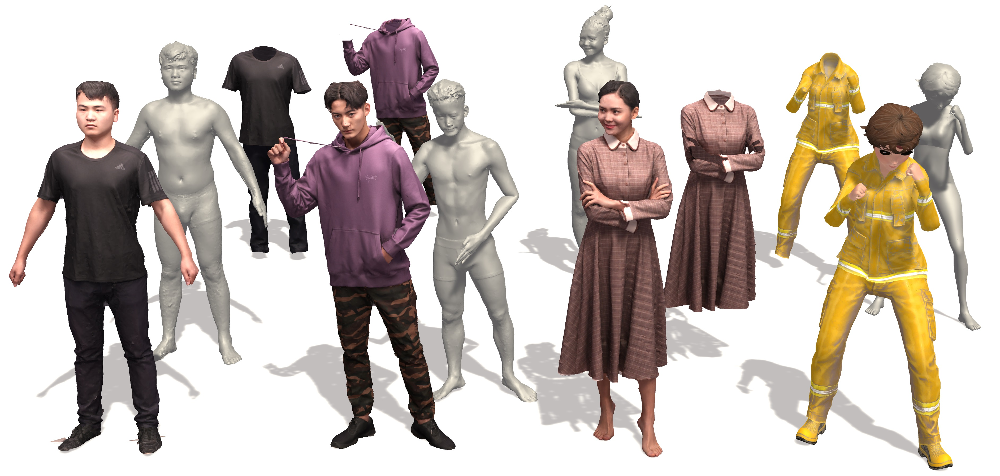
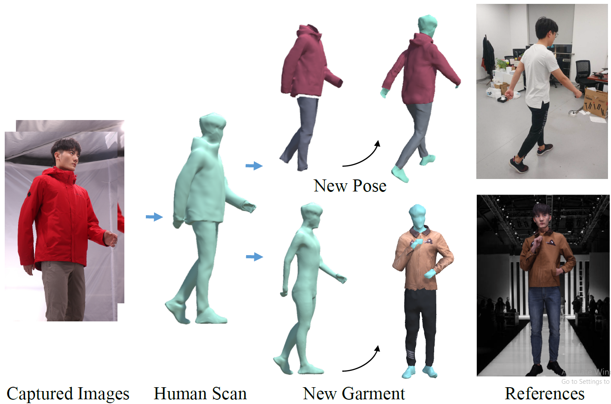
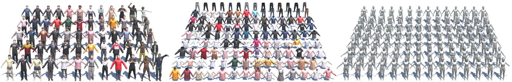

# TightCap: 3D Human Shape Capture with Clothing Tightness Field
### [ProjectPage](https://chenxin.tech/TightCap.html) | [Paper](https://arxiv.org/abs/1904.02601) | [Video](https://chenxin.tech/files/Paper/TOG2021_TightCap/project_page_TightCap/data/video.mp4) |  Dataset ( [static_part](https://1drv.ms/u/s!AsWCggO4PIEBo5pw_uKpM88UQ6AVSA?e=x5ylVh) |  [dynamic_part](https://1drv.ms/u/s!AsWCggO4PIEBo5p0s3bCkLdva7y8lg?e=6UMRiG))
[Xin Chen](https://chenxin.tech/), Anqi Pang, [Wei Yang](https://scholar.google.com/citations?user=fRjxdPgAAAAJ&hl=en), Peihao Wang, [Lan Xu](http://xu-lan.com/), [Jingyi Yu](http://www.yu-jingyi.com/).</br>
In SIGGRAPH 2022 (Journal Track).
</br>


This repository contains the official implementation for the paper: [TightCap: 3D Human Shape Capture with Clothing Tightness Field (SIGGRAPH 2022)](https://arxiv.org/abs/1904.02601). Our work is capable of capturing both the human shape and dressed garments accurately with only a single 3D human scan.<br>
<p float="center">
  
  
</p>

## Abstract
In this paper, we present TightCap, a data-driven scheme to capture both the human shape and dressed garments accurately with only a single 3D human scan, which enables numerous applications such as virtual try-on, biometrics, and body evaluation. We propose a new clothing tightness dataset (CTD) of human scans with a large variety of clothing styles, poses, and corresponding ground-truth human shapes to stimulate further research. Extensive experiments demonstrate the effectiveness of our TightCap to achieve the high-quality human shape and dressed garments reconstruction, as well as the further applications for clothing segmentation, retargeting, and animation.

[comment]: <To break the severe variations of the human poses and garments, we propose to model the clothing tightness field – the displacements from the garments to the human shape implicitly in the global UV texturing domain. To this end, we utilize an enhanced statistical human template and an effective multi-stage alignment scheme to map the 3D scan into a hybrid 2D geometry image. Based on this 2D representation, we propose a novel framework to predict clothing tightness field via a novel tightness formulation, as well as an effective optimization scheme to further reconstruct multi-layer human shape and garments under various clothing categories and human postures.> 

## Citation
If you find our code or paper useful, please consider citing:
```
@article{chen2021tightcap,
  title={TightCap: 3D Human Shape Capture with Clothing Tightness Field},
  author={Chen, Xin and Pang, Anqi and Wei, Yang and Peihao, Wang and Xu, Lan and Yu, Jingyi},
  journal={ACM Transactions on Graphics (Presented at ACM SIGGRAPH)},
  year={2021}
}
```
You can also put a star :star:, if the code is useful to you.

## The CTD Dataset
TightCap proposes a new clothing tightness dataset (CTD) of human scans with a large variety of clothing styles, poses, and corresponding ground-truth human shapes to stimulate further research.

<p float="left">
  
  
  
</p>

### Download
You can download the CTD dataset (version 1.0) with the static/dynamic part from the OneDrive links. Please unzip each part with all downloaded volumes.

* [CTD_Static_part](https://1drv.ms/u/s!AsWCggO4PIEBo5pw_uKpM88UQ6AVSA?e=x5ylVh) (20GB, 228 different garments) The static meshes, various clothed humans with segmented top/down clothing/shoes and carved bodies.
* [CTD_Dynamic_part](https://1drv.ms/u/s!AsWCggO4PIEBo5p0s3bCkLdva7y8lg?e=6UMRiG) (15GB, 652 annotated meshes from dynamic 3D human sequences, 13 sequences in total) The dynamic meshes, per-frame clothed humans with segmented top/down clothing/shoes and carved bodies.

### Annotation
The CTD dataset contains various and rich annotations for different 2D/3D vision and graphics tasks, like human generation, body estimation, pose retargeting, clothing segmentation, virtual try-on, neural rendering and so on. The high quality textures support re-rendering multi-view virtual input images for algorithm verification and quantitative experiments.

For the static part, each folder (named with the mesh code, see below) includes naked, top, bottom, shoes and original textured mesh. We visualize all meshes for preview and provide the mesh part annotation in **meshcode_labelsV.txt**.
```
f: female, m: male
c: coat, d: dress, t: t-shirt, p: pants
```
For the dynamic part, each sequence also includes naked, top/bottom, and original textured mesh. These annotated frames are selected from original dynamic clip under 30 FPS. We also visualize these meshes. Moreover, we will release these dynamic sequences soon, and you can refer to [Multi-view Neural Human Rendering (NHR)](https://github.com/wuminye/NHR) for more dynamic mesh sequences and the code for neural human rendering.

### Tools - DomeViewer
[DomeViewer](https://github.com/ChenFengYe/TightCap/tree/master/DomeViewer) is designed to support CTD dataset based on Unity3D engine, which can play 4D free-viewpoint video with dynamic mesh sequences. You can freely pause, play and fast forward the model after loading, and unlike traditional videos, you can control the rotation of the viewpoint with the right mouse button to experience 4D video clip.
<p float="left">
  
  
</p>

### Tools - Dataset
The tools folder includes the index lists for mesh details.
```
index_dynamic.xlsx, index_static.xlsx
```

### Contactor
Xin Chen, Email: chenxin2@shanghaitech.edu.cn

To encourage related research, we have provided the download link dataset. Please make sure the dataset is used for non-commercial purposes. Cosidering the privacy issue, **do not give it to any third party or publish it publicly anywhere**. If you download our dataset, it means you have agreed to our terms of access in the declaration.
<!-- To encourage related research, we will provide the dataset according to your request. Please email your **full name and affiliation** and **the completed** [**declaration**](https://github.com/ChenFengYe/TightCap/blob/master/Declaration/TightCap_Declaration.pdf) with **your school email account**  to the contact person (chenxin2@shanghaitech.edu.cn). We ask for your information only to make sure the dataset is used for non-commercial purposes. We will not give it to any third party or publish it publicly anywhere. Due to the privacy issue we will not provide the license plates in the future. If you download our dataset, it means you have agreed to our terms of access in the declaration. -->

* [Declaration on the usage of scientific data in the project TightCap](https://github.com/ChenFengYe/TightCap/blob/master/Declaration/TightCap_Declaration.pdf)

## Licenses
<a rel="license" href="http://creativecommons.org/licenses/by-nc-sa/4.0/"></a><br />This work is licensed under a <a rel="license" href="http://creativecommons.org/licenses/by-nc-sa/4.0/">Creative Commons Attribution-NonCommercial-ShareAlike 4.0 International License</a>.

All material is made available under [Creative Commons BY-NC-SA 4.0](https://creativecommons.org/licenses/by-nc-sa/4.0/legalcode) license. You can **use, redistribute, and adapt** the material for **non-commercial purposes**, as long as you give appropriate credit by **citing our paper** and **indicating any changes** that you've made.

## Relevant Works
[**Multi-view Neural Human Rendering (CVPR 2020)**](https://github.com/wuminye/NHR)<br>
Minye Wu, Yuehao Wang, Qiang Hu, Jingyi Yu

[**SportsCap: Monocular 3D Human Motion Capture and Fine-grained Understanding in Challenging Sports Videos (IJCV 2021)**](https://chenxin.tech/SportsCap.html)<br>
Xin Chen, Anqi Pang, Wei Yang, Yuexin Ma, Lan Xu, Jingyi Yu

[**ChallenCap: Monocular 3D Capture of Challenging Human Performances using Multi-Modal References (CVPR Oral 2021)**](https://arxiv.org/abs/2103.06747)<br>
Yannan He, Anqi Pang, Xin Chen, Han Liang, Minye Wu, Yuexin Ma, Lan Xu

[**AutoSweep: Recovering 3D Editable Objects from a Single Photograph (TVCG 2018)**](https://chenxin.tech/AutoSweep.html)<br>
Xin Chen, Yuwei Li, Xi Luo, Tianjia Shao, Jingyi Yu, Kun Zhou, Youyi Zheng

[**SMPL: A Skinned Multi-Person Linear Model (TOG 2015)**](https://smpl.is.tue.mpg.de/)<br>
Matthew Loper, Naureen Mahmood, Javier Romero, Gerard Pons-Moll, Michael J. Black

[**Detailed, accurate, human shape estimation from clothed 3D scan sequences (CVPR 2017)**](http://buff.is.tue.mpg.de/)<br>
Chao Zhang, Sergi Pujades, Michael J Black and Gerard Pons-Moll
